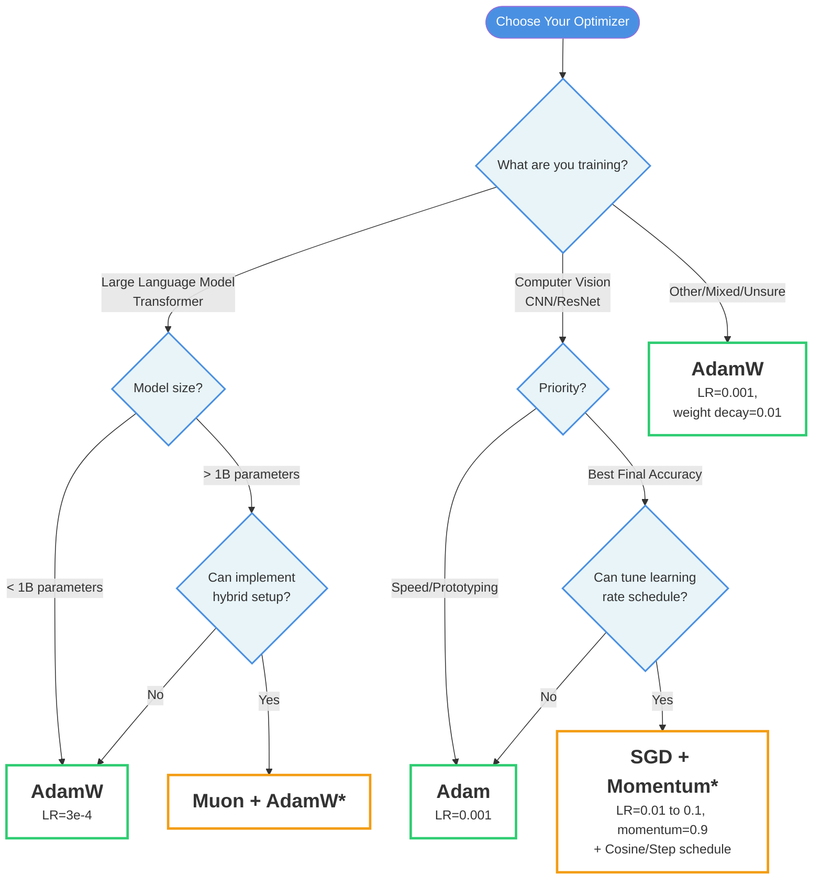

---
>**TLDR:** This guide covers 8 neural network optimizers from SGD to Muon. **For most tasks, start with Adam or AdamW**—they're robust and require minimal tuning. **For large language models, consider Muon** for 2x faster training. **For computer vision with proper learning rate scheduling, SGD+Momentum often achieves the best final accuracy**. Each optimizer builds on the limitations of its predecessors, from basic SGD through adaptive methods (Adam/AdamW) to modern matrix-aware approaches (Muon).

---
## Table of Contents

1. [Quick Reference: Optimizer Comparison](#quick-reference-optimizer-comparison)
2. [When to Use Which Optimizer](#when-to-use-which-optimizer)
3. [Optimizers Explained](#optimizers-explained)
   - [Stochastic Gradient Descent (SGD)](#1-stochastic-gradient-descent-sgd)
   - [Momentum](#2-momentum)
   - [Nesterov Momentum](#3-nesterov-momentum)
   - [AdaGrad](#4-adagrad)
   - [RMSProp](#5-rmsprop)
   - [Adam (Adaptive Moment Estimation)](#6-adam-adaptive-moment-estimation)
   - [AdamW](#7-adamw)
   - [Muon (MomentUm Orthogonalized by Newton-Schulz)](#8-muon-momentum-orthogonalized-by-newton-schulz)
4. [Detailed Technical Comparison](#detailed-technical-comparison)
5. [Hyperparameter Reference](#hyperparameter-reference)
6. [Common Pitfalls and How to Avoid Them](#common-pitfalls-and-how-to-avoid-them)
7. [Conclusion](#conclusion)

---


Training neural networks is fundamentally an optimization problem: we're searching for the best set of weights that minimize our loss function. While the concept sounds straightforward, the path from random initialization to a well-trained model is rarely a smooth descent. The landscape of loss functions in high-dimensional spaces is filled with valleys, plateaus, and saddle points that can trap or slow down naive optimization approaches.

This is where optimization algorithms come in. Over the years, researchers have developed increasingly sophisticated methods to navigate these challenging landscapes more efficiently. Each optimizer builds upon the limitations of its predecessors, introducing new mechanisms to accelerate convergence, handle sparse gradients, or adapt to different learning scenarios.

In this guide, we'll explore eight key optimization techniques: SGD, Momentum, Nesterov Momentum, AdaGrad, RMSProp, Adam, AdamW and Muon. We'll examine how each one works, what problems it solves, and when you might want to use it.

---

## Quick Reference: Optimizer Comparison

| Optimizer | Key Feature | Solves Issue in | Pros | Cons |
|-----------|-------------|-----------------|------|------|
| SGD | Simple gradient descent | N/A | Easy to implement | Oscillation, fixed learning rate |
| Momentum | Gradient accumulation | SGD | Reduces oscillations | No anticipation of future trends |
| Nesterov | Lookahead gradients | Momentum | Better convergence | Slightly higher computation |
| AdaGrad | Adaptive learning rates | Nesterov | Handles sparse gradients | Learning rate decays too fast |
| RMSProp | Smoothed adaptive learning rates | AdaGrad | Stabilizes learning rates | Sensitive to hyperparameters |
| Adam | Momentum + RMSProp | RMSProp | Combines best features | May converge to suboptimal minima |
| AdamW | Decoupled weight decay | Adam | Better generalization | Requires tuning decay parameter |
| Muon | Matrix orthogonalization | AdamW | 33% less memory, automatic LR transfer, faster convergence | Only for 2D matrices, requires hybrid approach |

---

## When to Use Which Optimizer

The flowchart below will help you quickly choose the right optimizer for your task:


**Key for Flowchart:**
- **Blue-filled**: Starting point and decision questions
- **Green Border**: Recommended safe defaults (Adam/AdamW)
- **Orange Border**: Advanced options with higher payoff (Muon, SGD+schedule)


### Detailed Guidance

**For Large Language Models (LLMs):**
- Models < 1B params: `AdamW` (lr=3e-4, betas=(0.9, 0.95))
- Models > 1B params: `Muon` + `AdamW` hybrid (possible 2x speedup)

**For Computer Vision:**
- Quick prototyping: `Adam` (lr=0.001) 
- Best accuracy: `SGD` + `Momentum` + `LR scheduling` (lr=0.01-0.1) 

**Special Cases:**
- NLP with Sparse features: `Adam` or `AdaGrad` (lr=0.001-0.01)
- Memory constrained: `Muon` or `SGD+Momentum`
- Fast experimentation: `Adam/AdamW`

**When in doubt:** Start with `AdamW` (lr=0.001, weight_decay=0.01). It's a solid default choice for almost any task.

---


## 1. [Stochastic Gradient Descent (SGD)](https://projecteuclid.org/euclid.aoms/1177729586)

**How It Works:** Updates weights by calculating gradients using a small batch of data.

$$w_t = w_{t-1} - \eta \nabla f(w_{t-1})$$

**Pros:**
- Simple and computationally efficient
- Works well with large datasets

**Cons:**
- Can oscillate or converge slowly, especially in narrow valleys or near saddle points
- Learning rate (η) is fixed, leading to potential overshooting or slow convergence

**Code:**
```python
import torch.optim as optim

optimizer = optim.SGD(model.parameters(), lr=0.01, weight_decay=0.0001)
```
---

## 2. [Momentum](https://hengshuaiyao.github.io/papers/polyak64.pdf)

**How It Works:** Accumulates gradients to build momentum in directions with consistent gradients.

$$v_t = \beta v_{t-1} - \eta \nabla f(w_{t-1})$$<br>
$$w_t = w_{t-1} + v_t$$

**Pros:**
- Speeds up convergence in shallow but consistent directions (e.g., valleys)
- Reduces oscillations compared to SGD

**Cons:**
- Still overshoots if the learning rate is too high
- Cannot predict future gradient directions

**Improvement Over SGD:** Addresses oscillation and slow convergence by incorporating past gradients.

**Code:**
```python
optimizer = optim.SGD(model.parameters(), lr=0.01, momentum=0.9, weight_decay=0.0001)
```

---

## 3. [Nesterov Momentum](https://proceedings.mlr.press/v28/sutskever13.pdf)

**How It Works:** Looks ahead by computing gradients at the projected position.

$$v_t = \beta v_{t-1} - \eta \nabla f(w_{t-1} + \beta v_{t-1})$$<br>
$$w_t = w_{t-1} + v_t$$

**Pros:**
- More precise updates by considering where the momentum is leading
- Accelerates convergence further compared to vanilla momentum

**Cons:**
- Slightly more computationally expensive due to gradient computation at the lookahead point

**Improvement Over Momentum:** Anticipates future gradient directions, resulting in better convergence.

**Code:**
```python
optimizer = optim.SGD(model.parameters(), lr=0.01, momentum=0.9, nesterov=True, weight_decay=0.0001)
```

---

## 4. [AdaGrad](https://www.jmlr.org/papers/volume12/duchi11a/duchi11a.pdf)


**How It Works:** Adjusts the learning rate for each parameter based on the magnitude of past gradients.

$$g_t = \nabla f(w_{t-1})$$<br>
$$w_t = w_{t-1} - \frac{\eta}{\sqrt{G_t + \epsilon}} g_t, \quad G_t = \sum_{i=1}^t g_i^2$$

**Pros:**
- Works well for sparse gradients (e.g., NLP tasks)
- Automatically adapts learning rates for each parameter

**Cons:**
- Learning rate diminishes too quickly due to cumulative gradient sum, leading to potential underfitting

**Improvement Over Nesterov Momentum:** Introduces adaptive learning rates to handle sparse gradients.

---

## 5. [RMSProp](https://www.cs.toronto.edu/~tijmen/csc321/slides/lecture_slides_lec6.pdf)

**How It Works:** Modifies AdaGrad by using an exponentially weighted moving average of past squared gradients instead of a cumulative sum.

$$v_t = \beta v_{t-1} + (1 - \beta)(\nabla f(w_{t-1}))^2$$<br>
$$w_t = w_{t-1} - \frac{\eta}{\sqrt{v_t + \epsilon}} \nabla f(w_{t-1})$$

**Pros:**
- Prevents the learning rate from diminishing too quickly
- Suitable for non-stationary objectives

**Cons:**
- Sensitive to hyperparameter choices (e.g., β)

**Improvement Over AdaGrad:** Stabilizes learning rates by introducing an exponentially weighted average of squared gradients.

---

## 6. [Adam](https://arxiv.org/pdf/1412.6980) (Adaptive Moment Estimation)

**How It Works:** Combines Momentum (first moment) and RMSProp (second moment).

- Update rules:<br>
$$m_t = \beta_1 m_{t-1} + (1 - \beta_1) \nabla f(w_{t-1})$$<br>
$$v_t = \beta_2 v_{t-1} + (1 - \beta_2)(\nabla f(w_{t-1}))^2$$<br>

- Bias corrections:<br>
$$\hat{m}_t = \frac{m_t}{1 - \beta_1^t}, \quad \hat{v}_t = \frac{v_t}{1 - \beta_2^t}$$<br>

- Update step:<br>
$$w_t = w_{t-1} - \frac{\eta}{\sqrt{\hat{v}_t} + \epsilon} \hat{m}_t$$

**Pros:**
- Combines the benefits of Momentum and RMSProp
- Automatically adjusts learning rates for each parameter
- Bias correction ensures stability in early training

**Cons:**
- May converge to suboptimal solutions in some scenarios (e.g., small datasets or high regularization)
- Hyperparameter tuning can be challenging

**Improvement Over RMSProp:** Adds momentum and bias correction to handle noisy gradients and early instability.

**Code:**
```python
optimizer = optim.Adam(model.parameters(), lr=0.001, betas=(0.9, 0.999), eps=1e-8)
```

---

## 7. [AdamW](https://arxiv.org/pdf/1711.05101)

**How It Works:**

Decouples weight decay from the gradient update to improve generalization.

$$w_t = w_{t-1} - \eta \bigg( \frac{\hat{m}_t}{\sqrt{\hat{v}_t} + \epsilon} + \lambda w_{t-1} \bigg)$$

**Pros:**
- Better generalization compared to Adam
- Retains benefits of adaptive learning rates

**Cons:**
- Still requires careful hyperparameter tuning

**Improvement Over Adam:** Decouples weight decay from gradient updates, improving generalization performance.

**Code (Common Settings for Transformers):**
```python
optimizer = optim.AdamW(model.parameters(), lr=3e-4, betas=(0.9, 0.95), eps=1e-8, weight_decay=0.1)
```

---

## 8. [Muon](https://kellerjordan.github.io/posts/muon/) (MomentUm Orthogonalized by Newton-Schulz)

**How It Works:**

Muon is designed specifically for 2D weight matrices in neural network hidden layers (Linear layers). Unlike traditional optimizers that treat each parameter independently, Muon leverages the geometric structure of weight matrices by orthogonalizing gradients using the Newton-Schulz iteration.

The optimizer formulates weight updates as a constrained optimization problem in the RMS-to-RMS operator norm space:

$$\min_{\Delta W} \langle G, \Delta W \rangle \quad \text{subject to} \quad |\Delta W|_{op,RMS} \leq \beta$$

Where $G$ is the gradient matrix. The solution involves projecting the gradient onto the set of orthogonal matrices, which standardizes all singular values to 1 while preserving gradient directions. Its github implementation can be found [here.](https://github.com/KellerJordan/Muon)

**Update Rules:**

1. **Momentum accumulation:**
   $$V_t = \mu V_{t-1} + G_t$$

2. **Newton-Schulz orthogonalization (5 iterations):**
   $$Z_0 = \frac{V_t}{\|V_t\|_F}$$
   $$Z_{i+1} = aZ_i + bZ_i^3 + cZ_i^5$$
   
   Default coefficients: $(a, b, c) = (3.4445, -4.775, 2.0315)$

3. **Weight update:**
   $$W_t = W_{t-1} - \eta \cdot Z_{final} - \lambda W_{t-1}$$

**Important:** Muon should **only** be applied to 2D weight matrices (hidden layer Linear layers). All other parameters (embeddings, biases, normalization layers, classifier heads) must use a standard optimizer like AdamW.

**Pros:**

* **Memory efficient:** Only tracks momentum (no second moment statistics like Adam), reducing memory by ~33% compared to Adam
* **Automatic learning rate transfer:** Learning rates transfer across different network widths without retuning
* **Superior convergence:** Faster training than Adam/AdamW, especially for transformers and large models
    - Improved CIFAR-10 training speed record from 3.3 to 2.6 A100-seconds for 94% accuracy
    - Improved NanoGPT speedrunning record by 1.35x
    - Trained 1.5B transformer to GPT-2 XL performance in 10 hours vs 13.3 hours with AdamW
* **Better saddle point handling:** Orthogonalization helps escape saddle points more effectively
* **Scalable:** Performance improvements increase with model size

**Cons:**

* **Hybrid approach required:** Must use AdamW or another optimizer for non-2D parameters
* **Higher computational cost:** Newton-Schulz iterations add ~5% overhead (though Turbo-Muon reduces this to ~1%)
* **Implementation complexity:** More complex than standard optimizers
* **Limited to dense layers:** Only applicable to Linear layers with dense activations

**Improvement Over AdamW:** Exploits the matrix structure of neural network weights rather than treating parameters independently. This geometric approach provides automatic scaling properties and faster convergence while using less memory. Particularly effective for transformer architectures and language model pre-training.

**Code:**
```python
from muon import MuonWithAuxAdam

# Separate parameters by type
hidden_weights = [p for p in model.body.parameters() if p.ndim >= 2]
hidden_gains_biases = [p for p in model.body.parameters() if p.ndim < 2]
nonhidden_params = [*model.head.parameters(), *model.embed.parameters()]

# Create parameter groups
param_groups = [
    dict(params=hidden_weights, use_muon=True, lr=0.02, weight_decay=0.01),
    dict(params=hidden_gains_biases+nonhidden_params, use_muon=False, 
         lr=3e-4, betas=(0.9, 0.95), weight_decay=0.01),
]

optimizer = MuonWithAuxAdam(param_groups)
```
---
## Detailed Technical Comparison

| Method | Working Mechanism | Pros | Cons | Improvement Over Prior Method |
|--------|-------------------|------|------|-------------------------------|
| **SGD** | Updates weights using gradients calculated on mini-batches. $w_t = w_{t-1} - \eta\nabla f(w_{t-1})$ | Simple, computationally efficient | Oscillates, slow convergence, fixed learning rate | - |
| **Momentum** | Accumulates gradients to build momentum for smoother updates. $v_t = \beta v_{t-1} - \eta\nabla f(w_{t-1})$, $w_t = w_{t-1} + v_t$ | Speeds up convergence, reduces oscillations | May overshoot, lacks anticipation of future gradients | Reduces oscillations and improves convergence speed |
| **Nesterov** | Looks ahead to compute gradients at a projected future position. $v_t = \beta v_{t-1} - \eta\nabla f(w_{t-1} + \beta v_{t-1})$, $w_t = w_{t-1} + v_t$ | More precise updates, faster convergence | Slightly more computationally expensive | Anticipates future gradient directions |
| **AdaGrad** | Adjusts learning rates based on accumulated squared gradients. $w_t = w_{t-1} - \frac{\eta}{\sqrt{G_t + \epsilon}}g_t$, $G_t = \sum g_i^2$ | Adapts learning rates, good for sparse gradients | Learning rate diminishes too quickly, potential underfitting | Introduces adaptive learning rates for sparse features |
| **RMSProp** | Uses exponentially weighted moving averages of squared gradients. $v_t = \beta v_{t-1} + (1-\beta)g_t^2$, $w_t = w_{t-1} - \frac{\eta}{\sqrt{v_t + \epsilon}}g_t$ | Prevents learning rate decay, handles non-stationary objectives | Sensitive to hyperparameters (e.g., β) | Stabilizes learning rates using moving averages |
| **Adam** | Combines Momentum (1st moment) and RMSProp (2nd moment) with bias correction. $w_t = w_{t-1} - \frac{\eta}{\sqrt{\hat{v}_t} + \epsilon} \hat{m}_t$ | Fast convergence, handles noisy gradients | May converge to suboptimal minima in some cases | Combines momentum and adaptive learning rates |
| **AdamW** | Decouples weight decay from gradient updates. $w_t = w_{t-1} - \eta[\frac{\hat{m}\_t}{\sqrt{\hat{v}\_t} + \epsilon} + \lambda w_{t-1}]$ | Better generalization, retains Adam's benefits | Requires tuning of decay parameter | Improves generalization by decoupling weight decay |
| **Muon** | Orthogonalizes gradients of weight matrices using Newton-Schulz iteration, then applies Newton-Schulz polynomial to normalize $V_t$. $V_t = \mu V_{t-1} + G_t$, $W_t = W_{t-1} - \eta \cdot \text{NS}(V_t) - \lambda W_{t-1}$ | Fast convergence, memory efficient, automatic LR transfer across model sizes | Only for 2D parameters, requires hybrid approach with AdamW | Leverages matrix geometry for better conditioning and faster training |

---

## Hyperparameter Reference

| Method | Hyperparameter | Meaning | Typical Values | Tuning Suggestions |
|--------|----------------|---------|----------------|-------------------|
| **SGD** | Learning rate ($\eta$) | Step size for updating weights | 0.01 to 0.1 | Start with a smaller value and adjust based on convergence |
| **Momentum** | Momentum coefficient ($\beta$) | Controls the contribution of past gradients to the current update | 0.9 | Keep fixed at 0.9 or tune slightly |
| **Nesterov** | Momentum coefficient ($\beta$) | Same as Momentum, with anticipation of future gradients | 0.9 | Same as Momentum |
| **AdaGrad** | Learning rate ($\eta$) | Base learning rate scaled by the inverse square root of accumulated squared gradients | 0.01 | Lower than SGD learning rates to avoid overshooting |
| **RMSProp** | Learning rate ($\eta$) | Similar to AdaGrad, with smoothing via an exponential moving average | 0.001 to 0.01 | Tune for stability based on loss |
| | Decay rate ($\beta$) | Smoothing parameter for the moving average of squared gradients | 0.9 | Commonly fixed at 0.9 |
| **Adam** | Learning rate ($\eta$) | Base learning rate for parameter updates | 0.001 | Often works well without much tuning |
| | $\beta_1$ | Decay rate for the first moment (mean of gradients) | 0.9 | Usually fixed |
| | $\beta_2$ | Decay rate for the second moment (variance of gradients) | 0.999 | Keep fixed or tune slightly for sensitivity |
| | $\epsilon$ | Small value to avoid division by zero | $10^{-7}$ or smaller | Rarely changed |
| **AdamW** | Learning rate ($\eta$) | Same as Adam | 0.001 | Same as Adam |
| | $\beta_1$, $\beta_1$, $\epsilon$ | Same as Adam | 0.9, 0.999, $10^{-7}$ | Same as Adam |
| | Weight decay ($\lambda$) | Regularization parameter to control overfitting by penalizing large weights | $10^{-4}$ to $10^{-2}$ | Start small and increase if overfitting is observed |
| **Muon** | Learning rate ($\eta$) | Base learning rate for matrix updates | 0.02 (can be 5-10x larger than Adam) | Start with 0.02, can use much larger values than Adam |
| | Momentum ($\mu$) | Momentum coefficient | 0.95 | Usually fixed at 0.95 |
| | Weight decay ($\lambda$) | Regularization parameter | 0.01 | Same as AdamW |
| | Nesterov | Whether to use Nesterov momentum | True | Typically enabled |
| | NS coefficients $(a,b,c)$ | Newton-Schulz polynomial coefficients | (3.4445, -4.775, 2.0315) | Rarely changed, but can be tuned for specific architectures |
| | **For non-2D params** | Use AdamW with standard settings | $\eta$ = 3e-4, $\beta_1$ = 0.9, $\beta_2$ = 0.95 | Keep separate learning rate for embeddings/biases |

---


## Common Pitfalls and How to Avoid Them

Even with the right optimizer, certain mistakes can derail your training. Here are the most common issues:

### 1. Using Adam without Learning Rate Decay
**Problem:** Adam can fail to converge to optimal solutions without learning rate scheduling.

**Solution:** Always use a learning rate scheduler with Adam/AdamW, especially for long training runs.
```python
scheduler = CosineAnnealingLR(optimizer, T_max=epochs)
```

### 2. SGD Learning Rate Too High
**Problem:** Divergence, exploding gradients, NaN losses.

**Solution:** Start with a conservative learning rate (0.01-0.1) and use warmup:
```python
# Warmup for first 5 epochs
if epoch < 5:
    lr = base_lr * (epoch + 1) / 5
else:
    lr = base_lr
```

### 3. Confusing Adam and AdamW
**Problem:** Using `torch.optim.Adam` when you meant to use weight decay.

**Critical:** In PyTorch, `Adam` with `weight_decay` parameter is **NOT** the same as `AdamW`!
```python
# WRONG - This is L2 regularization, not weight decay
optimizer = optim.Adam(model.parameters(), lr=0.001, weight_decay=0.01)

# CORRECT - Use AdamW for proper weight decay
optimizer = optim.AdamW(model.parameters(), lr=0.001, weight_decay=0.01)
```

### 4. Not Separating Parameter Groups for Muon
**Problem:** Applying Muon to all parameters (embeddings, biases, etc.) causes training instability.

**Solution:** Only use Muon for 2D weight matrices. Use AdamW for everything else:
```python
# Correctly separate parameters
hidden_weights = [p for p in model.parameters() if p.ndim >= 2]
other_params = [p for p in model.parameters() if p.ndim < 2]
```

### 5. Forgetting Gradient Clipping
**Problem:** Training instability, especially with RNNs, transformers, or high learning rates.

**Solution:** Add gradient clipping before optimizer step:
```python
loss.backward()
torch.nn.utils.clip_grad_norm_(model.parameters(), max_norm=1.0)
optimizer.step()
```

### 6. Using AdaGrad for Long Training
**Problem:** Learning rate diminishes to nearly zero, causing training to stall.

**Solution:** Use RMSProp or Adam instead for long training runs. AdaGrad works best for shorter, sparse gradient scenarios.

### 7. Ignoring Batch Size Effects
**Problem:** Optimizer performance varies dramatically with batch size.

**Key Rule:** Larger batch sizes often require larger learning rates:
```python
# Linear scaling rule (approximate)
lr = base_lr * (batch_size / base_batch_size)
```

### 8. Not Using Different Optimizers for Different Parameters
**Problem:** Embeddings and classifier heads may need different learning rates than the main network.

**Solution:** Use parameter groups:
```python
optimizer = optim.AdamW([
    {'params': model.embedding.parameters(), 'lr': 1e-3},
    {'params': model.encoder.parameters(), 'lr': 3e-4},
    {'params': model.head.parameters(), 'lr': 5e-4}
])
```

### 9. Misunderstanding Momentum Hyperparameters
**Problem:** Using $\beta_1 = 0.9$ for both Adam and SGD without understanding the difference.

**Key Insight:** 
- SGD Momentum: 0.9 is standard
- Adam $\beta_1$ : 0.9 is standard
- But they behave differently! Adam's momentum is applied to normalized gradients.

### 10. Not Validating Optimizer Setup
**Problem:** Subtle bugs in optimizer configuration go unnoticed until poor results.

**Solution:** Always verify your setup:
```python
# Check which parameters are being optimized
print(f"Optimizing {sum(p.numel() for p in optimizer.param_groups[0]['params'])} parameters")

# Verify learning rates
for i, group in enumerate(optimizer.param_groups):
    print(f"Group {i}: lr={group['lr']}, params={len(group['params'])}")
```

---
## Conclusion

Choosing the right optimizer can dramatically impact your model's training efficiency and final performance. While there's no universal "best" optimizer, understanding the strengths and weaknesses of each approach helps you make informed decisions for your specific use case.

For most modern deep learning applications, **Adam** and **AdamW** have emerged as go-to choices due to their robust performance across diverse tasks with minimal hyperparameter tuning. Adam's combination of momentum and adaptive learning rates makes it particularly effective for handling noisy gradients and training deep networks, while AdamW's improved weight decay mechanism often leads to better generalization.

**Muon** represents a paradigm shift in optimization by explicitly leveraging the matrix structure of neural network weights. For large-scale language model training, Muon has demonstrated consistent speed improvements over AdamW while using significantly less memory. Its ability to automatically transfer learning rates across model sizes makes it particularly valuable for scaling experiments. However, its requirement for a hybrid approach (using AdamW for non-matrix parameters) adds implementation complexity. If you're training large transformers and have the engineering resources to implement it properly, Muon is worth serious consideration.

Regardless of which optimizer you choose, **learning rate scheduling** is crucial for achieving optimal results. Modern training almost always combines an optimizer with a schedule like cosine annealing, step decay, or warmup-then-decay. The Adam paper's promise of "little tuning required" applies to the optimizer's internal hyperparameters ($\beta_1$, $\beta_2$), but you should still tune the learning rate and use scheduling for best results.

However, don't overlook the classics. **SGD with Momentum** remains highly competitive, especially for computer vision tasks, and often achieves better final test accuracy when combined with proper learning rate scheduling. For problems with sparse gradients, such as natural language processing with large vocabularies, **AdaGrad** or **RMSProp** might be more appropriate.

The key takeaway is that optimizer selection should be guided by your problem's characteristics: dataset size, gradient sparsity, computational budget, and generalization requirements. Start with a well-established baseline (Adam is usually a safe bet), monitor your training dynamics, and don't hesitate to experiment with alternatives if you're not seeing the convergence behavior you expect.

As the field continues to evolve, new optimizers and variants will undoubtedly emerge. But the fundamental principles underlying these eight methods: managing learning rates, leveraging momentum, adapting to gradient statistics, and combining optimizers, will remain central to training neural networks effectively. However, new optimizers like Muon (2024) show that there's still room for innovation. Stay curious, read the papers (linked throughout this guide) here and new papers, and don't be afraid to experiment with different optimizers for your specific use case.


