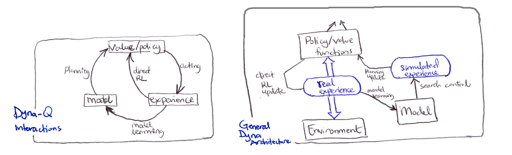
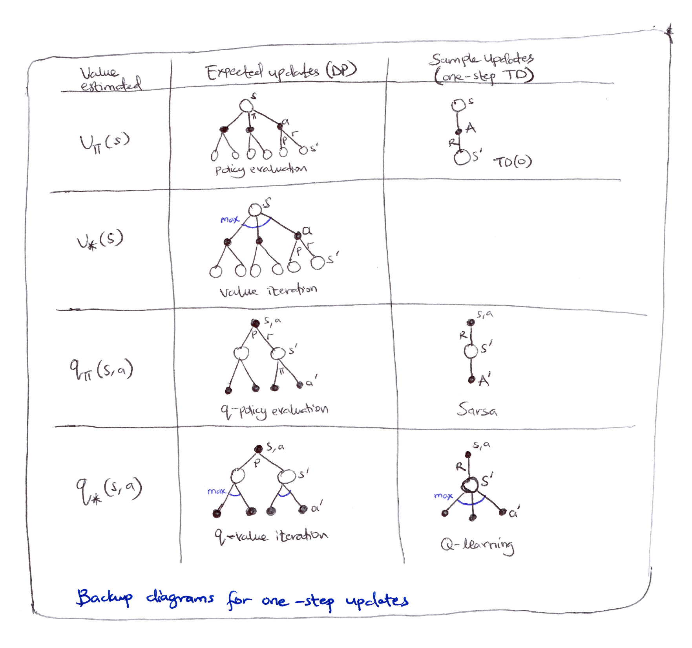
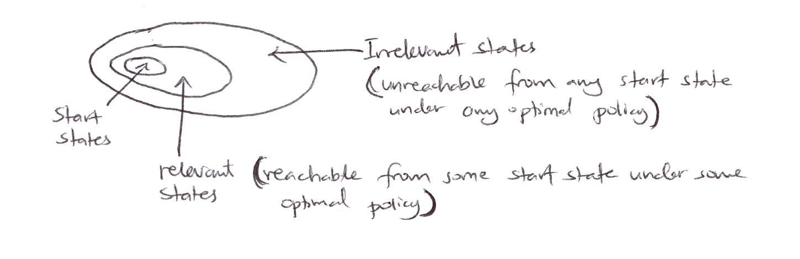
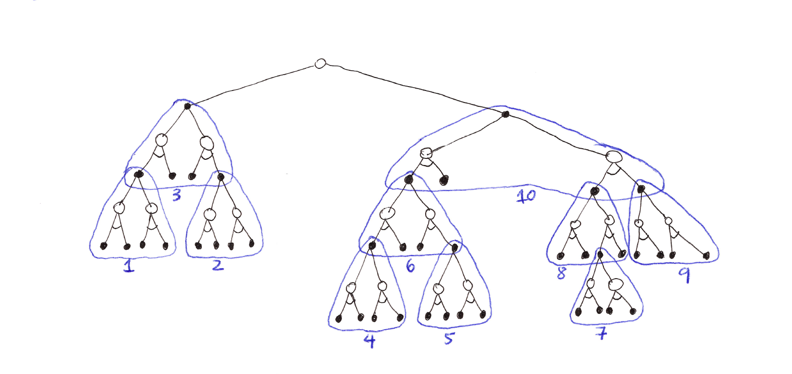
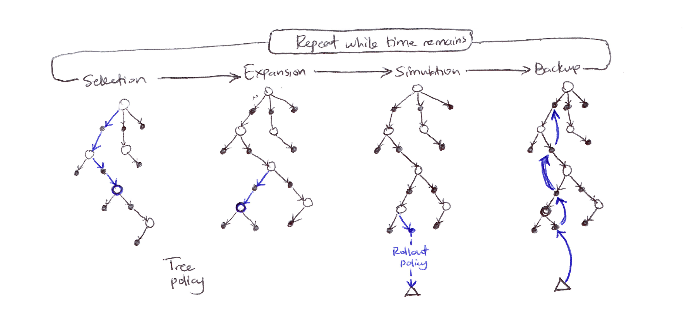
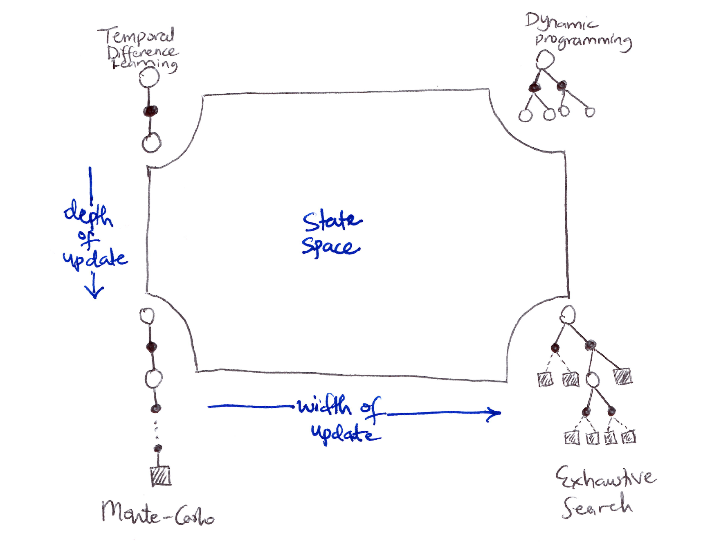

- **Model-Based RL methods** require a model of the environment and rely on **planning** as their primary component.
  - Dynamic Programming (DP), Heuristic Search
- **Model-Free RL methods** don't require a model of the environment and primarily rely on **learning**.
  - Monte Carlo (MC), Temporal-Difference (TD)
- Both methods still use value functions and both make backups to state values based on future returns.

---

## Table of Contents
- [8.1 Models & Planning](#81-models--planning)
- [8.2 Dyna: Integrated Planning, Acting, and Learning](#82-dyna-integrated-planning-acting-and-learning)
- [8.3 When the Model is Wrong](#83-when-the-model-is-wrong)
- [8.4 Prioritized Sweeping](#84-prioritized-sweeping)
- [8.5 Expected vs Sample Updates](#85-expected-vs-sample-updates)
- [8.6 Trajectory Sampling](#86-trajectory-sampling)
- [8.7 Real-Time Dynamic Programming (RTDP)](#87-real-time-dynamic-programming-rtdp)
- [8.8 Planning at Decision Time](#88-planning-at-decision-time)
- [8.9 Heuristic Search](#89-heuristic-search)
- [8.10 Rollout Algorithms](#810-rollout-algorithms)
- [8.11 Monte Carlo Tree Search (MCTS)](#811-monte-carlo-tree-search-mcts)
- [8.12 Summary](#812-summary)
- [8.13 Summary of Part I: Dimensions](#813-summary-of-part-i-dimensions)

---

## 8.1 Models & Planning

- A **model** is anything the agent can use to predict the environment's behavior.
  - Given a state and an action, a model predicts the next state and the next reward.
  - If the model is stochastic, then there are several possible next states and next rewards. The model produces:
    - All the possibilities and probabilities; these are **distribution models**.
    - One of the possibilities, sampled according to the probabilities; these are **sample models**.
- Models are used to simulate the environment and thus produce **simulated experiences**.

- **Planning** refers to any computational process that takes a model as input and produces or improves a policy for interacting with the modelled environment.

$$\text{model} \xrightarrow{\text{Planning}} \text{policy}$$

- There are 2 distinct approaches to planning:
  - **State-space planning**: search through the state space for an optimal policy. Actions cause transitions from state to state, and value functions are computed over states.
  - **Plan-space planning**: search through the space of plans. Operators transform one plan into another, and value functions, if any, are defined over the space of plans. e.g. Evolutionary methods, partial-order planning.

- **State-space planning common structure:**

$$\text{model} \to \text{simulated experience} \xrightarrow{\text{backups}} \text{values} \to \text{policy}$$

- All state-space planning methods involve computing value functions as a key intermediate step toward improving the policy.
- They compute value functions by updates or backup operations applied to simulated experience.

- Dynamic programming methods make sweeps through the space of states, generating for each state the distribution of possible transitions. Each distribution is then used to compute a backed-up value (update target) and update the state's estimated value.
- At the heart of both learning and planning is the estimation of value functions by backing-up update operations.
- The difference however is that:
  - Planning uses **simulated** experience generated by a model.
  - Learning uses **real** experience generated by the environment.
- Despite the differences, a learning algorithm can be substituted for the key update step of a planning method, because it applies just as well to simulated experience.

### Random-sample One-step Tabular Q-Learning

- A planning method based on one-step tabular Q-learning and on random samples from a sample model.
- It converges to the optimal policy for the model under the same conditions as that for the real environment.

### Pseudocode: Random-sample One-step Tabular Q-Learning

```
Loop forever:
    1. Select a state, S ∈ S, and an action, A ∈ A(S), at random
    2. Send S, A to a sample model, and obtain
       a sample next reward, R, and a sample next state, S'
    3. Apply one-step tabular Q-learning to S, A, R, S':
       Q(S,A) ← Q(S,A) + α[R + γ max_a Q(S',a) - Q(S,A)]
```

- Planning in very small, incremental steps may be the most **efficient** approach especially in large scale problems.

---

## 8.2 Dyna: Integrated Planning, Acting, and Learning



- When planning is done online, while interacting with the environment, a number of interesting issues arise:
  - New information gained from the interaction may change the model (and thus the planning).
  - How do we divide the computational resources available between decision making and model learning?

- **Dyna-Q**: a simple architecture integrating the major functions needed in an online planning agent.

- Within a planning agent, there are at least 2 roles for real experience:
  - **Model learning**: to improve the model (to make it more accurately match the real environment).
  - **Direct RL**: to directly improve the value function and policy.
  - **Indirect RL**: to indirectly improve the value functions and policies via the model (planning).

- Both direct and indirect methods have advantages and disadvantages:
  - Indirect methods often make fuller use of a limited amount of experience.
  - Direct methods are much simpler and are not affected by biases in the design of the model.

**Dyna-Q includes all of the RL processes in the interactions diagram shown above occurring continuously: planning, acting, model-learning, and direct RL.**

- The planning method is the random-sample, one-step tabular Q-planning.
- The model-learning method is also table-based and assumes the environment is deterministic.
  - After each transition $S_t, A_t \to R_{t+1}, S_{t+1}$, the model records in its table entry for $S_t, A_t$ the prediction that $R_{t+1}, S_{t+1}$ will deterministically follow.
  - Thus, if the model is queried with a state-action pair that has been experienced before, it simply returns the last $S_{t+1}, R_{t+1}$ experienced as its prediction.
  - During planning, the Q-learning algorithm randomly samples only from state-action pairs that have previously been experienced.

- Based on the overall architecture of Dyna agents:
  - **Search control**: the process that selects the starting states & actions for the simulated experiences.
  - Planning is achieved by applying RL methods to the simulated experiences just as if they had really happened.

- Typically, as in Dyna-Q, the same RL method is used both for learning from real experience and for planning from simulated experience.
- Learning and planning share almost all the **same** machinery, differing only in the source of their experience.
- Conceptually, planning, acting, direct RL, and model learning occur simultaneously and in parallel in Dyna agents. For computational concreteness and implementation, we specify the order of occurrence within a time step:
  - Acting, model-learning and direct RL processes require little time.
  - Planning takes the remaining time in each step because it is inherently computationally intensive.

### Tabular Dyna-Q Pseudocode

```
Initialize Q(s,a) and Model(s,a) for all s ∈ S, a ∈ A(s)

Loop forever:
    (a) S ← current (non-terminal) state
    (b) A ← ε-greedy(S, Q)
    (c) Take action A; observe resultant reward, R, and state, S'
    (d) Q(S,A) ← Q(S,A) + α[R + γ max_a Q(S',a) - Q(S,A)]
    (e) Model(S,A) ← R, S'  (assuming deterministic environment)
    (f) Loop repeat n times:
            S ← random previously observed state
            A ← random action previously taken in S
            R, S' ← Model(S, A)
            Q(S,A) ← Q(S,A) + α[R + γ max_a Q(S',a) - Q(S,A)]
```

- In the pseudocode algorithm for Dyna-Q above:
  - $\text{Model}(S,a)$ denotes the contents of the model (predicted $S_{t+1}$ & $R_{t+1}$) for state-action pair.
  - Direct RL, model-learning and planning are steps **(d), (e)** and **(f)** respectively.
  - If **(e)** and **(f)** were omitted, the algorithm becomes one-step tabular Q-learning.

- A simple maze example shows that adding planning ($n > 0$) dramatically improves the agent's behavior.
- Due to the incremental nature of planning, it is trivial to intermix planning & learning. Both proceed quickly. 
  - The agent is always reactive and deliberative, and yet always planning and model-learning in the background.

---

## 8.3 When the Model is Wrong

- Models may be incorrect because:
  - The environment is **stochastic** and only a limited number of samples have been observed.
  - The model was learned using function approximation that has **generalized imperfectly.**
  - The environment has **changed** and its new behavior has not yet been observed.

- In some scenarios, the suboptimal policy computed by planning quickly leads to the discovery and correction of the modeling error.
  - This tends to happen when the model aims to predict a greater reward than is possible.
  - The planned policy attempts to exploit these opportunities and discovers that they do not exist.

- Issues arise when the environment changes to become better than it was before, and yet the formerly correct policy does not reveal the improvement.
  - In these cases the current optimal policy remains unchanged, but there lies an even better policy available that the agent may never access because it has no reason to doubt its previously learned optimal policy.
  - To address this **exploration/exploitation tradeoff/conflict**, there is no perfect and practical solution, but there are simple heuristics that can be effective.
  - One proposed algorithm that used one such heuristic was the **Dyna-Q+** agent.

### Dyna-Q+

- The agent keeps track of the number of timesteps elapsed $\tau$ since a state-action pair had been selected, and if sufficient time has elapsed, it is presumed that the dynamics of the environment from that state has **changed** and the model of it is incorrect.
- A special bonus reward is added to simulated experience involving these actions to encourage **exploratory behavior** towards long-untried actions ($k\sqrt{\tau}$).
- The modelled rewards for each state-action pair now becomes $r + k\sqrt{\tau}$ for some small $k$.
  - $r$ is the initial unchanged model reward without any heuristic applied.
- This encourages the agent to be more exploratory to all accessible state transitions, and even though this may be costly computationally, it's **well worth it.**

---

## 8.4 Prioritized Sweeping

- In Dyna agents, simulated transitions are started in state-action pairs selected uniformly at random from all previously experienced state-action pairs.
  - Uniform selection is usually not the best; focusing on particular state-action pairs could be much more efficient for planning.

- **Prioritized sweeping** optimizes Dyna-style planning by selectively updating state-action pairs based on expected magnitude of value change, rather than uniform random selection.

- Steps:
  1. Keep a priority queue of which state-action pairs need updating most.
  2. Update the ones with biggest potential changes first.
  3. Work backwards from important states (like the goal).

- Mechanism:
  1. Maintain priority queue of $(s,a)$ pairs ranked by Bellman error magnitude.
  2. Propagate updates **backward** from states with changed values.
  3. Queue predecessors weighted by: ${|}R + \gamma V(s') - Q(s,a){|}$

- Key advantages:
  1. **Efficiency**: avoid wasteful updates (such as $0 \to 0$ reward transitions).
  2. **Convergence speed**: dramatic empirical improvements.
  3. **Backward focusing**: value propagation follows reverse trajectory from changed states.

- Extensions of prioritized sweeping to **stochastic environments** are straightforward:
  - **Expected updates**: enumerate all $s'$ with transition probabilities, which is comprehensive but computationally expensive on low-probability transitions.
  - **Sample updates**: lower variance per computation, better granularity enables selective focus on high-impact transitions.
  - Essentially, when outcomes are random, one can either update based on all possibilities (slow but thorough) or sample specific outcomes (faster, focuses effort).

- All planning entails sequences of value updates varying in:
  - Update type $\Rightarrow$ expected/sample, full/partial backup.
  - Update ordering $\Rightarrow$ backward/forward focusing, prioritization heuristic.
- Forward focusing prioritizes states by reachability under current policy rather than backward value propagation.

---

## 8.5 Expected vs Sample Updates

- So far in the book we've discussed dynamic programming (DP) as a way of conducting policy evaluation and policy improvement given a distribution model of the environment.
- We've also discussed sampling methods like Monte Carlo (MC), temporal-difference (TD), and $n$-step bootstrapping to estimate value functions in the absence of a model.
- Given a fixed computational budget, are expected or sample updates more efficient for planning?



> **Backup diagrams for one-step updates**: a large tree rooted at the current state, with branches for each action and subtrees for each successor. The tree policy traverses the tree greedily, evaluating and backing up values from the leaf nodes toward the root.

| Value estimated | Expected updates (DP) | Sample updates (one-step TD) |
|---|---|---|
| $V_\pi(s)$ | Policy evaluation<br>(full branching over actions & next states) | TD(0)<br>(single sampled transition) |
| $V_*(s)$ | Value iteration (max over actions, full branching) | — |
| $q_\pi(s,a)$ | $q$-policy evaluation | Sarsa |
| $q_*(s,a)$ | $q$-value iteration | Q-learning |

**Backup diagrams for one-step updates** (7 of 8 cases shown)

- We have considered many value function updates. If we focus on one-step updates, they vary along 3 binary dimensions:
  - Whether they update state values or action values.
  - Whether they estimate the value for the optimal policy or for an arbitrary given policy.
  - Whether the updates are **expected updates** (consider all possible events that might happen) or **sample updates** (consider a single sample of what might happen).
- These 3 binary dimensions give rise to 8 cases, 7 of which are shown in the figure above. The 8th case does not seem to correspond to any useful update.

- Any of these one-step updates can be used in planning methods:
  - **Dyna-Q** uses $q_{*}$ sample updates, but could also use $q_{*}$ expected updates, or either expected or sample $q_\pi$ updates.
  - **Dyna-AC** uses $V_\pi$ sample updates together with a learning policy structure.
  - For stochastic problems, prioritized sweeping is always done using one of the expected updates.

- Absence of a distribution model means that expectation is impossible, but sampling can be done.
  - So which is better? Expectation or Sampling?
    - Expected updates yield a better estimate because they are uncorrupted by sampling error.
    - Expected updates require more computation, and computation is often the limiting resource in planning.

### Computational Requirements & Formal Comparison (given discrete states/actions)

- <u>Model:</u> $\hat{p}(s', r \mid s, a)$ known.
- <u>Goal:</u> Approximate $q_{*}$ (optimal action values).
- <u>Branching factor:</u> $b = {|}\{s': p(s' \mid s,a) > 0\}{|}$ (effective stochasticity).

- **Expected Update (exact):**
  - <u>Computational complexity:</u> $O(b)$.

$$\boxed{Q(s,a) \leftarrow \sum_{s', r} \hat{p}(s', r | s, a)\left[r + \gamma \max_{a'} Q(s', a')\right]}$$

- **Sample Update (stochastic):**
  - <u>Computational complexity:</u> $O(1)$.

$$\boxed{Q(s,a) \leftarrow Q(s,a) + \alpha\left[R + \gamma \max_{a'} Q(S', a') - Q(s,a)\right]}$$

- In the same fixed time budget for 1 expected update, you get $b$ sample updates.

### Theoretical Comparison (Empirical Analysis)

- Assume all $b$ successors are equiprobable, and initial $ {|}\text{error}{|} = 1$ at $(s,a)$; successor values are assumed already correct.
- Expected update: error $= 0$ after one update (cost: $\sim b$ units).
- Sample updates (assuming sample averages, i.e. $\alpha = \frac{1}{t}$): error $\approx \sqrt{\frac{b-1}{bt}}$.
  - For moderate $b$ (e.g. $b = 10$) and large $b$, the error falls dramatically with a tiny fraction of $b$ updates.

  - For large $b$, error drops exponentially fast early for sample updates, allowing broad updates across many $(s,a)$ pairs in the same time as one expected update:

$$\text{error} = \sqrt{\frac{b-1}{bt}}$$

  - For large $b$: $\text{error} \approx \sqrt{\frac{1}{t}}$, $\therefore \lim_{t \to \infty} \sqrt{\frac{1}{t}} \to 0$.

$$b=1,\ \text{error} = 0 \text{ for } t \geq 1$$

$$b=2,\ \text{error} = \frac{1}{\sqrt{2t}} \implies \text{error}(t=1) \approx 0.707,\ \text{error}(t=2) = 0.5$$

$$b=100,\ \text{error} \approx \frac{1}{\sqrt{t}} \implies \text{error}(t=1) \approx 0.995,\ \text{error}(t=10) \approx 0.316,\ \text{error}(t=100) \approx 0.1$$

- Pros of sample updates:
  - **Breadth vs depth**: cover more state space per unit computation.
  - **Bootstrap benefits**: earlier updates improve successor value estimates for subsequent backups.
  - **Diminishing returns**: marginal value of incorporating low-probability branches is low.

- Sample updates dominate in large-scale stochastic domains where exhaustive sweeping is intractable.
- Expected updates only preferable when:
  - Small branching factor ($b \leq 3$).
  - Small state space (exact solution feasible).
  - Deterministic dynamics ($b = 1$, methods are equivalent).

---

## 8.6 Trajectory Sampling

- Let's compare two ways of distributing updates:
  - **Exhaustive Sweeps**: classical DP approach that entails performing sweeps through the entire state (or state-action) space, updating each state (or state-action pair) once per sweep. Computationally inefficient especially on large tasks (no time to complete one full sweep).
  - **Trajectory Sampling**: generate simulated trajectories by rolling out the current policy in the model, performing one-step backups along the trajectory.

- 2 common sampling distributions:
  - Uniform sampling of states or state-action pairs.
  - On-policy distribution.

- For planning updates in tabular RL, should state-action pairs be selected uniformly or according to the on-policy distribution?

### Formal Comparison

- **Uniform distribution:**
  - Cycle systematically through all ${|}S{|} \times {|}A{|}$ state-action pairs.
  - Each pair receives equal computational resources.
  - Complete coverage regardless of policy.
  - Starting state distribution $\approx$ uniform or some fixed distribution $\mu(S_t)$.

- **On-policy trajectory sampling:**
  - Sample states $S_t \sim d^\pi$ where $d^\pi$ is the on-policy state distribution under policy $\pi$.
  - Select actions $a_t \sim \pi(\cdot \mid S_t)$.
  - Generate trajectories $\{S_0, a_0, S_1, a_1, \ldots\}$ following current policy.
  - Update only visited state-action pairs.

- **Advantages of trajectory sampling:**
  - **Computational focusing**: for large state spaces where ${|}S{|} \gg$ states reachable under $\pi$, trajectory sampling concentrates updates on the reachable subset.
  - **Irrelevant state pruning**: 3 categories emerge:
    - Initial states (starting distribution).
    - States reachable under optimal control.
    - Irrelevant states (never visited optimally).

- **Disadvantages/Limitations of trajectory sampling:**
  - Requires a generative model to simulate trajectories.
  - May miss important states early in learning if policy is poor.
  - Can be sample-inefficient if trajectories are long.


- On-policy distribution sampling is useful/better for problems with large state-spaces and small branching factors (prioritized sweeping).
- Trajectory sampling is orthogonal to prioritization. The former addresses which states to update, while the latter addresses in what order. They can be combined.

- Trajectory sampling anticipates importance sampling concepts in off-policy learning and naturally extends to continuous state spaces with function approximation.

---

## 8.7 Real-Time Dynamic Programming (RTDP)

- RTDP is an on-policy trajectory-sampling version of the value-iteration algorithm of dynamic programming (DP).
- RTDP is an asynchronous DP algorithm; 
  - async DP algorithms are not organized in terms of systematic sweeps of the state set, instead
  - they update state values in any order whatsoever, using whatever values of other states happen to be available.


- RTDP is basically the combination of 3 ideas:
  - **On-policy trajectory sampling** $\Rightarrow$ follow the current greedy policy.
  - **Asynchronous updates** $\Rightarrow$ only update states you actually visit in any order.
  - **Focused learning** $\Rightarrow$ concentrate on **"relevant states"** (states on good paths to the goal).

- **RTDP update rule:**

$$\boxed{V(S_t) \leftarrow \max_{a \in A}\left(R^a_{S_t} + \gamma \sum_{s'} P^a_{S_t s'}\, V(s')\right)}$$

- RTDP's relationship to other methods:
  - **Value Iteration**: 
    - VI updates all states per iteration; 
    - RTDP updates only states on sampled trajectories.
  - **Prioritized Sweeping**: 
    - PS uses model to work backward from goals; 
    - RTDP follows forward trajectories.
  - **Trajectory Sampling**: 
    - TS can use any policy; 
    - RTDP uses greedy policy for sampling.

- **Computational Complexity:**

  - Traditional Value Iteration $\Rightarrow O({|}S{|}^2{|}A{|})$ per iteration.
  - RTDP Trial $\Rightarrow O(L)$ where $L$ = episode length, typically $L \ll {|}S{|}$.

- RTDP bridges pure planning and pure learning (focusing on relevant state space regions).
- RTDP is guaranteed to find an optimal policy for the relevant states under certain conditions:
  1. The initial value of every goal state is zero.
  2. There exists at least one policy that guarantees that a goal state will be reached with probability one from any start state.
  3. All rewards for transitions from non-goal states are strictly negative.
  4. All the initial values are equal to or greater than their optimal values (which can be satisfied by simply setting the initial values of all states to zero).

- Tasks with these properties are usually called **stochastic optimal path problems**.
  - RTDP can find optimal policies for these tasks with approximately 50% of the computation required by traditional sweep-based value iteration (i.e. dynamic programming).
  - These kinds of problems are usually expressed in cost minimization not reward maximization.



> **State space diagram**: Start states on the left, irrelevant states (unreachable from any start state under any optimal policy) in the outer region, and relevant states (reachable from some start state under some optimal policy) in the inner region.

### Heuristic Initialization (Optimistic)

- RTDP typically initializes $V$ with an admissible heuristic $h(s)$ where $h(s) \geq V^*(s)$.
- This provides optimistic values that guide exploration towards goal states.

### Considerations

- Most effective domains for RTDP are domains with:
  - Large state spaces.
  - Sparse goal states.
  - Clearly defined initial distribution.
  - Deterministic or near-deterministic dynamics.

---

## 8.8 Planning at Decision Time

- Planning can be used in at least 2 ways:
  - **Background planning**: planning that occurs independently of and prior to the need for action. Here planning is used to gradually improve a policy/value function on the basis of simulated experience from a model, then selects an action via lookup.
  - **Decision-time planning**: planning that occurs at the moment an action is required after encountering the current state. It's essentially planning at the time of action selection.

- Decision-time planning is useful when fast response is not required and the state space is large. In low-latency actions, background planning is better for action selection.
- Decision-time planning is **memoryless** (discards updates after selection of action), but background planning is **persistent** (permanently stores and accumulates learned values).

---

## 8.9 Heuristic Search

- The classical state-space planning methods are decision-time planning methods collectively known as **heuristic search**.
- In heuristic search, for each state encountered, a large tree of possible continuations is considered.
  - The search evaluates leaf nodes at the end of the search and backs up the values to the state-action nodes for the current states.
  - The value maximising action from the current state is found and then selected (the values are usually discarded).
- This kind of planning is effective because it focuses only on pertinent next states and actions, and focuses resource on obtaining the next best one-step action.
- Heuristic search is an extension of greedy policy beyond one-step to multi-step lookahead to obtain better action selections.



> **Heuristic Search diagram (selective depth-first search)**: a large tree rooted at the current state, with branches for each action and subtrees for each successor. The tree policy traverses the tree greedily, evaluating and backing up values from the leaf nodes toward the root.

### Theoretical Properties

1. **Optimality horizon**: for sufficiently large depth $K$ where $\gamma^K \approx 0$, the selected action approaches the optimal action $a^*(s)$.
2. **Computational complexity**:
   - Full tree expansion: $O(b^K)$ where $b$ = branching factor.
   - With pruning/selection: $O(f(b, K))$ where $f < b^K$.
3. **Memory**: $O(bK)$ with depth-first implementation.
4. **Backed-up value interpretation**: $V_{\text{tree}}(s)$ estimates the $K$-step optimal value starting from $s$.

---

## 8.10 Rollout Algorithms

- Rollout algorithms are decision-time planning algorithms based on Monte Carlo control applied to simulated trajectories that all begin at the current environment state.
- They estimate action values for a given policy by averaging the returns of many simulated trajectories that start with each possible action and then follow the given policy.

- **Key characteristics:**
  - It is memoryless; it doesn't store/update a permanent value table (no persistence).
  - The rollout policy $\Pi$ is usually the current greedy policy.
  - Relies on MC averaging to reduce variance (more rollouts $\to$ better estimates).
  - It's quite very simple; no tree-building, no backups during rollouts.

- **Goal**: 
  - Not to estimate a complete $q_*$ or $q_\pi$ for a given policy $\pi$; instead the focus is on MC estimates of action values only for each current state and for a given fixed policy called the **rollout policy**. 
  - Improve upon rollout policy, not find optimal policy.

- Rollout algorithms follow the **policy improvement theorem** by acting greedily w.r.t. $\hat{Q}(s,a)$:
  - If $q_\pi(s,a) \geq v_\pi(s)$ for any 2 policies $\pi$ and $\pi'$, then $\pi' \geq \pi$.

### Computational Complexity (quite expensive due to many full episodes)

- Per decision $\Rightarrow:
  - ${|}A(s){|}$ = number of actions to evaluate, 
  - $n$ = rollouts per action, 
  - $L$ = average episode length.

$$\text{total cost} = O\left(|A(s)| \cdot n \cdot L\right)$$

- As we can see the computational time depends on many factors and balancing these factors is very important and challenging. To handle the challenge:
  - It is possible to run many trials in parallel on separate processors (because the MC trials are independent of one another).
  - Truncate the simulated trajectories short of complete episodes, correcting the truncated returns by means of a stored evaluation function.
  - Pruning away candidate actions that are unlikely to be the best.

- Rollout algorithms aren't learning algorithms because of no long-term memory of values/policies.
  - But they still use RL techniques: **Monte Carlo control + Policy Improvement Theorem.**
  - Use MC control to estimate action values via averaging the returns of a collection of sample trajectories.
  - Take advantage of the policy improvement property by acting greedily w.r.t. the estimated action values.

---

## 8.11 Monte Carlo Tree Search (MCTS)

- MCTS is a rollout algorithm that is enhanced by the addition of a means for accumulating value estimates obtained from the MC simulations in order to successively direct simulations toward more highly-rewarding trajectories.
- It is a best-first search algorithm that builds a decision tree incrementally by iteratively sampling trajectories through an MDP, using statistical confidence bounds for exploration-exploitation balance.
- When the environment changes to a new state, MCTS executes as many iterations as possible before an action needs to be selected, incrementally building a tree whose root node represents the current state.

**Each iteration consists of 4 operations:**

### 1. Selection
- Starting at the root node, a tree policy based on the action values attached to the edges of the tree traverses the tree to select a leaf node.
- Traverse tree using tree policy (typically **UCT**):

$$\boxed{\text{UCT}(s,a) = \underbrace{\frac{W(s,a)}{N(s,a)}}_{\text{exploitation}} + c\underbrace{\sqrt{\frac{\ln(N(s))}{N(s,a)}}}_{\text{exploration}} = Q(s,a) + c\sqrt{\frac{\ln(N(s))}{N(s,a)}}}$$

- where:
  - $Q(s,a)$ = average return from $(s,a) = \frac{W(s,a)}{N(s,a)}$
  - $W(s,a)$ = total reward accumulated through $(s,a)$
  - $N(s,a)$ = visit count for $(s,a)$
  - $N(s)$ = visit count for parent state $s$
  - $c$ = exploration constant (typically $\sqrt{2}$); 
    - $c < 0.5 \Rightarrow$ more exploitation 
    - $c > 2 \Rightarrow$ more exploration

- Selection terminates when:
  - Leaf node is reached (not fully expanded).
  - Terminal state is reached.

### 2. Expansion
- On some iterations, the tree is expanded from the selected leaf node by adding one or more child nodes reached from the selected node via unexplored actions.
- Expansion strategies:
  - Single child per iteration (standard).
  - All children at once (batch expansion).
  - Progressive widening for continuous actions.

### 3. Simulation
- From the selected node, or from one of its newly-added child nodes (if any), simulation of a complete episode is run with actions selected by the rollout policy (actions are selected first by the tree policy and beyond the tree by the rollout policy).

### 4. Backup
- The return generated by the simulated episode is backed up to update, or to initialize, the action values attached to the edges of the tree traversed by the tree policy in this iteration of MCTS.
- Propagate simulation result up the path and update all nodes/edges on the path.

- MCTS continues executing these 4 steps, starting each time at the tree's root node, until no more time is left, or some other computational resource is exhausted. 
- Then finally, an action from the root node (representative of the environment's current state) is selected according to some mechanism that depends on the accumulated statistics in the tree (action with largest action value or action with largest visit count to avoid outliers).



> **MCTS diagram**: 4 stages shown left to right: Selection (tree policy traverses with blue arrows to a leaf), Expansion (leaf expanded), Simulation (rollout policy runs from expanded node to terminal $\Delta$), Backup (return propagated back up with blue arrows).

### MCTS Pseudocode

**Main loop:**
```
Initialize: root = current state, S_0
for i = 1 to num_simulations:
    node = Selection(root)
    node = Expansion(node)
    Δ = Simulation(node)
    Backup(node, Δ)
return argmax_a N(S_0, a)
```

**Expansion:**
```
If non-terminal leaf reached:
    select unvisited action a' ∈ A(S) \ {visited actions}
    create child node S' ~ p(·|S, a')
    add to tree
    return S'
```

**Simulation:**
```
S ← expanded_node
G ← 0
t ← 0
while S non terminal:
    a ~ Π_default(·|S)
    r, S' ~ p(·|S, a)
    G ← G + γᵗ r
    S ← S'
    t ← t + 1
return G
```

**Backup:**
```
while node ≠ null:
    N(node) ← N(node) + 1
    W(node) ← W(node) + Δ
    node ← node.parent
```

### Computational Complexity

- Per iteration (where $d$ = tree depth, $L$ = episode length): 
  - Selection: $O(d)$, 
  - Expansion: $O(1)$, 
  - Simulation: $O(L)$, 
  - Backup; $O(d)$ 

$$\Rightarrow \text{total: } O\!\left(n \cdot (d + L)\right) \text{ for } n \text{ simulations}$$

### Summary of MCTS

- MCTS is a decision-time planning algorithm based on Monte Carlo control applied to simulations that start from the root state.
- MCTS benefits from online, incremental, sample-based value estimation & policy improvement.
- MCTS saves action-value estimates attached to the tree edges and updates them using RL's sample updates.
- MCTS, via incremental tree expansion, effectively grows a lookup table to store a partial action-value function.
- MCTS thus avoids the problem of globally approximating an action-value function while it retains the benefit of using past experience to guide exploration.

### Pros & Cons of MCTS

- **Pros**: anytime algorithm, asymmetric tree growth, no domain heuristic required, handles high branching factors.
- **Cons**: high computational cost, may miss deep forced sequences, random rollouts that are weak in tactical domains, finite simulations miss long-term consequences.

---

## 8.12 Summary

- Planning requires a model of the environment.
  - A **distribution model** consists of the probabilities of next states and rewards for possible actions. Dynamic Programming requires a distribution model because it uses expected updates, which involve computing expectations over all the possible next states and rewards.
  - A **sample model** is required for simulating the environment interaction using sample updates.
  - Sample models are generally much easier to obtain than distribution models.

- There exists a close relationship between planning optimal behavior and learning optimal behavior:
  - Both involve estimating the same value functions.
  - Both naturally update the estimates incrementally, in a long series of small backup operations.
  - Any of the learning methods can be converted into planning methods simply by applying them to simulated rather than real experience (model-based not model-free).

- It is straightforward to integrate incremental planning methods with acting and model-learning. Planning, acting and model-learning interact in a circular fashion, each producing what the other needs to improve. All processes naturally proceed asynchronously and in parallel.

- **Dimensions of variation among state-space planning methods:**
  - **Size of updates**: the smaller the updates, the more incremental the planning methods can be. One-step updates, as in Dyna, are the smallest updates.
  - **Distribution of updates**: primarily regarded as the focus of search.
    - **Prioritized sweeping** focuses backward on the predecessors of recently changed states.
    - **On-policy trajectory sampling** focuses on states/state-action pairs that are likely.

- **Real-time DP (RTDP),** an on-policy trajectory sampling version of value iteration, illustrates some of the advantages that focusing on the relevant regions of the state-space has over conventional sweep-based policy iteration (exhaustive).

- Planning can also focus forward from pertinent states, such as states actually encountered during an agent-environment interaction, and the most important form of this is when **planning is done at decision time** as part of the action-selection process.
  - Another example of this is **classical heuristic search.**
  - Other examples are **rollout algorithms & Monte Carlo Tree Search (MCTS)** that both benefit from online, incremental, sample-based value estimation and policy improvement.

---

## 8.13 Summary of Part I: Dimensions

**Two axes for the update diagram:**

>$$\text{HORIZONTAL (L to R): sample backups} \xrightarrow{\text{width of update}} \text{full/expected backups}$$
>$$\text{VERTICAL (Top to Bottom): shallow backups} \xrightarrow{\text{depth/length of update}} \text{deep backups}$$



> **Unified View of RL** depicting a slice through the space of RL methods

- Each RL idea presented so far can be viewed as a dimension along which methods vary. The set of the dimensions spans a large space of possible methods (quasi-infinite possibilities).
- All the methods discussed so far in this book have 3 key ideas in common:
  - They all seek to estimate value functions.
  - They all operate by backing up values along actual or possible state trajectories.
  - They all follow the general strategy of **generalized policy iteration (GPI).** This means they maintain an approximate value function and an approximate policy, and they continually try to improve each on the basis of the other.

- 3 important **dimensions** along which RL methods vary:
  - **Width of updates**: sample updates (based on a sample trajectory) vs expected updates (based on a distribution of possible trajectories).
  - **Depth of updates**: degree of bootstrapping ($\lambda$).
  - **On-policy vs off-policy methods**.

- **Other dimensions along which RL methods vary:**
  - **Definition of return**: is the task episodic or continuing, discounted or undiscounted?
  - **Action values vs state values vs afterstate values**.
  - **Action selection/exploration**: how are actions selected to ensure a suitable exploration/exploitation tradeoff? Simple ways considered are $\varepsilon$-greedy, optimistic initialization, soft-max, upper confidence bound (UCB).
  - **Synchronous vs asynchronous**: are the updates for all states performed simultaneously or one-by-one in some order?
  - **Real vs simulated experience**.
  - **Location of updates**: what states or state-action pairs should be updated? Model-free methods can choose only among encountered states, but model-based methods can choose arbitrarily.
  - **Timing of updates**: should updates be done as part of action selection, or only afterward?
  - **Memory for updates**: how long should updated values be retained?
    - Should they be retained permanently? (**persistence**)
    - Or only while computing an action selection and then discarded? (**memoryless**)

- These dimensions are **neither exhaustive nor mutually exclusive.** e.g. Dyna methods use both real and simulated experience to affect the same value function.
- These dimensions constitute a coherent set of ideas for description & exploration of a wide space of possible methods.

- The most important dimension not mentioned or covered yet is that of **function approximation**:
  - Function approximation can be viewed as an orthogonal spectrum of possibilities ranging from **tabular methods** at one extreme through **state aggregation**, a variety of **linear methods**, and then a diverse set of **non-linear methods**.
